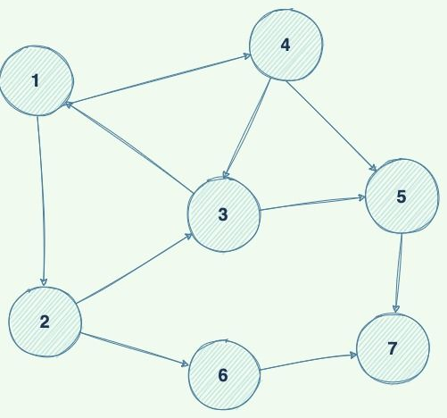

# ICPC_training

Repositorio para guardar soluciones de ICPC

## Leaderboard

### Season 2

Crea un programa que pueda buscar un número en el siguiente grafo:

| Nombre | Binary search | BFS | DFS |
|--- | --- | --- | --- |

### Season 1

| Nombre | Binary search | BFS | DFS |
|--- | --- | --- | --- |
| Tomas | 3:41 | 2:00 | 20:00 |  
| Mario | 2:00 | 10:00 | 10:00 |
| Nicolas | 1:55 | 5:00 | 28:00 | 
| Salvador | 4:40 | 30:00 | 30:00 | 
| Diego | 5:50 | 30:00 | 25:00 |
| Santiago | 8:00 | 20:00 | 15:00 |

## Soluciones a concursos

- [ICPC 2024 - Repechaje](./ICPC_2024/Readme.md)
- [ICPC 2023](./ICPC_2023/Readme.md)
- [EasyPeasy](./EasyPeasy/Readme.md)

